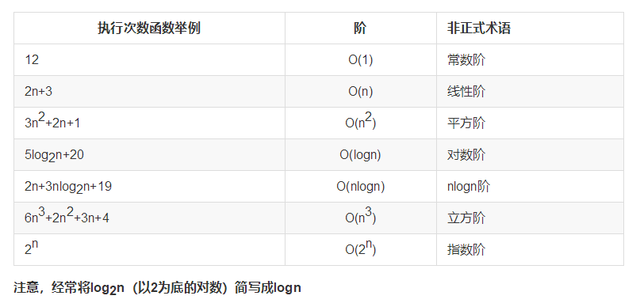
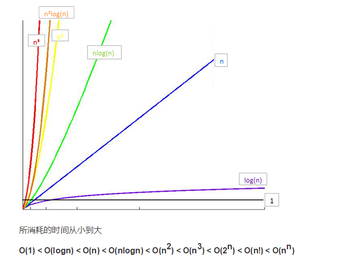

# 算法的提出

## 算法的概念

算法是计算机处理信息的本质，因为计算机程序本质上是一个算法来告诉计算机确切的步骤来执行一个指定的任务。一般地，当算法在处理信息时，会从输入设备或数据的存储地址读取数据，把结果写入输出设备或某个存储地址供以后再调用。

### 算法是独立存在的一种解决问题的方法和思想。

对于算法而言，实现的语言并不重要，重要的是思想。

算法可以有不同的语言描述实现版本（如C描述、C++描述、Python描述等），我们现在是在用Python语言进行描述实现。

## 算法的五大特性
1.输入: 算法具有0个或多个输入
2.输出: 算法至少有1个或多个输出
3.有穷性: 算法在有限的步骤之后会自动结束而不会无限循环，并且每一个步骤可以在可接受的时间内完成
4.确定性：算法中的每一步都有确定的含义，不会出现二义性
5.可行性：算法的每一步都是可行的，也就是说每一步都能够执行有限的次数完成

# 算法效率衡量
## 执行时间反应算法效率
对于同一问题，我们给出了两种解决算法，在两种算法的实现中，我们对程序执行的时间进行了测算，发现两段程序执行的时间相差悬殊（214.583347秒相比于0.182897秒），由此我们可以得出结论：实现算法程序的执行时间可以反应出算法的效率，即算法的优劣。

## 单靠时间值绝对可信吗？
假设我们将第二次尝试的算法程序运行在一台配置古老性能低下的计算机中，情况会如何？很可能运行的时间并不会比在我们的电脑中运行算法一的214.583347秒快多少。

单纯依靠运行的时间来比较算法的优劣并不一定是客观准确的！

程序的运行离不开计算机环境（包括硬件和操作系统），这些客观原因会影响程序运行的速度并反应在程序的执行时间上。那么如何才能客观的评判一个算法的优劣呢？

## 时间复杂度与“大O记法”
我们假定计算机执行算法每一个基本操作的时间是固定的一个时间单位，那么有多少个基本操作就代表会花费多少时间单位。算然对于不同的机器环境而言，确切的单位时间是不同的，但是对于算法进行多少个基本操作（即花费多少时间单位）在规模数量级上却是相同的，由此可以忽略机器环境的影响而客观的反应算法的时间效率。

对于算法的时间效率，我们可以用“大O记法”来表示。

“大O记法”：对于单调的整数函数f，如果存在一个整数函数g和实常数c>0，使得对于充分大的n总有f(n)<=c*g(n)，就说函数g是f的一个渐近函数（忽略常数），记为f(n)=O(g(n))。也就是说，在趋向无穷的极限意义下，函数f的增长速度受到函数g的约束，亦即函数f与函数g的特征相似。

时间复杂度：假设存在函数g，使得算法A处理规模为n的问题示例所用时间为T(n)=O(g(n))，则称O(g(n))为算法A的渐近时间复杂度，简称时间复杂度，记为T(n)

## 如何理解“大O记法”
对于算法进行特别具体的细致分析虽然很好，但在实践中的实际价值有限。对于算法的时间性质和空间性质，最重要的是其数量级和趋势，这些是分析算法效率的主要部分。而计量算法基本操作数量的规模函数中那些常量因子可以忽略不计。例如，可以认为和属于同一个量级，如果两个算法处理同样规模实例的代价分别为这两个函数，就认为它们的效率“差不多”，都为级。

## 最坏时间复杂度
分析算法时，存在几种可能的考虑：

*   算法完成工作最少需要多少基本操作，即最优时间复杂度
*   算法完成工作最多需要多少基本操作，即最坏时间复杂度
*   算法完成工作平均需要多少基本操作，即平均时间复杂度
对于最优时间复杂度，其价值不大，因为它没有提供什么有用信息，其反映的只是最乐观最理想的情况，没有参考价值。

对于最坏时间复杂度，提供了一种保证，表明算法在此种程度的基本操作中一定能完成工作。

对于平均时间复杂度，是对算法的一个全面评价，因此它完整全面的反映了这个算法的性质。但另一方面，这种衡量并没有保证，不是每个计算都能在这个基本操作内完成。而且，对于平均情况的计算，也会因为应用算法的实例分布可能并不均匀而难以计算。

#### 因此，我们主要关注算法的最坏情况，亦即最坏时间复杂度。

## 时间复杂度的几条基本计算规则
1.基本操作，即只有常数项，认为其时间复杂度为O(1)

2.顺序结构，时间复杂度按加法进行计算

3.循环结构，时间复杂度按乘法进行计算

4.分支结构，时间复杂度取最大值

判断一个算法的效率时，往往只需要关注操作数量的最高次项，其它次要项和常数项可以忽略
在没有特殊说明时，我们所分析的算法的时间复杂度都是指最坏时间复杂度

# 常见时间复杂度

# 常见时间复杂度之间的关系

