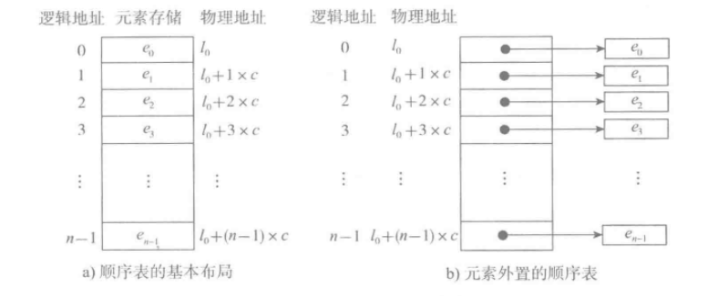

# 顺序表
在程序中，经常需要将一组（通常是同为某个类型的）数据元素作为整体管理和使用，需要创建这种元素组，用变量记录它们，传进传出函数等。一组数据中包含的元素个数可能发生变化（可以增加或删除元素）。

对于这种需求，最简单的解决方案便是将这样一组元素看成一个序列，用元素在序列里的位置和顺序，表示实际应用中的某种有意义的信息，或者表示数据之间的某种关系。

这样的一组序列元素的组织形式，我们可以将其抽象为线性表。一个线性表是某类元素的一个集合，还记录着元素之间的一种顺序关系。线性表是最基本的数据结构之一，在实际程序中应用非常广泛，它还经常被用作更复杂的数据结构的实现基础。

根据线性表的实际存储方式，分为两种实现模型：

*  顺序表，将元素顺序地存放在一块连续的存储区里，元素间的顺序关系由它们的存储顺序自然表示。
*  链表，将元素存放在通过链接构造起来的一系列存储块中。

# 顺序表的基本形式

图a表示的是顺序表的基本形式，数据元素本身连续存储，每个元素所占的存储单元大小固定相同，元素的下标是其逻辑地址，而元素存储的物理地址（实际内存地址）可以通过存储区的起始地址Loc (e0)加上逻辑地址（第i个元素）与存储单元大小（c）的乘积计算而得，即：

#### Loc(ei) = Loc(e0) + c*i

故，访问指定元素时无需从头遍历，通过计算便可获得对应地址，其时间复杂度为O(1)。

如果元素的大小不统一，则须采用图b的元素外置的形式，将实际数据元素另行存储，而顺序表中各单元位置保存对应元素的地址信息（即链接）。由于每个链接所需的存储量相同，通过上述公式，可以计算出元素链接的存储位置，而后顺着链接找到实际存储的数据元素。
#### 注意，图b中的c不再是数据元素的大小，而是存储一个链接地址所需的存储量，这个量通常很小。

图b这样的顺序表也被称为对实际数据的索引，这是最简单的索引结构。
