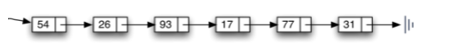
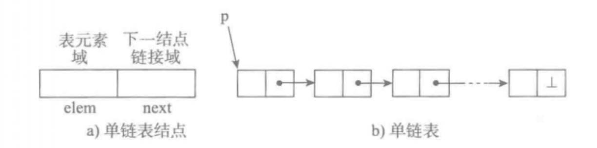
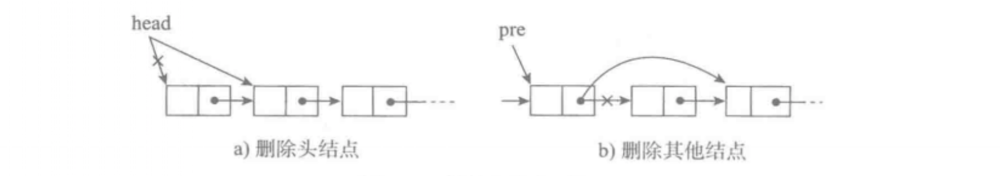
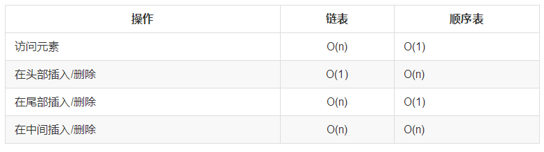
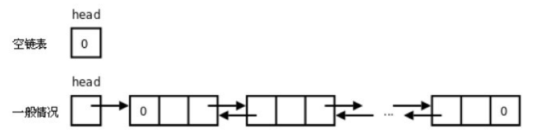

# 链表
## 为什么需要链表
顺序表的构建需要预先知道数据大小来申请连续的存储空间，而在进行扩充时又需要进行数据的搬迁，所以使用起来并不是很灵活。

链表结构可以充分利用计算机内存空间，实现灵活的内存动态管理。

## 链表的定义
链表（Linked list）是一种常见的基础数据结构，是一种线性表，但是不像顺序表一样连续存储数据，而是在每一个节点（数据存储单元）里存放下一个节点的位置信息（即地址）。



# 单向链表
单向链表也叫单链表，是链表中最简单的一种形式，它的每个节点包含两个域，一个信息域（元素域）和一个链接域。这个链接指向链表中的下一个节点，而最后一个节点的链接域则指向一个空值。



*  表元素域elem用来存放具体的数据。
*  链接域next用来存放下一个节点的位置（python中的标识）
*  变量p指向链表的头节点（首节点）的位置，从p出发能找到表中的任意节点。

## 节点实现

``` py
class SingleNode(object):
    """单链表的结点"""
    def __init__(self,item):
        # _item存放数据元素
        self.item = item
        # _next是下一个节点的标识
        self.next = None
```
## 单链表的操作
*  is_empty() 链表是否为空
*  length() 链表长度
*  travel() 遍历整个链表
*  add(item) 链表头部添加元素
*  append(item) 链表尾部添加元素
*  insert(pos, item) 指定位置添加元素
*  remove(item) 删除节点
*  search(item) 查找节点是否存在
## 单链表的实现
``` py
class SingleLinkList(object):
    """单链表"""
    def __init__(self):
        self._head = None

    def is_empty(self):
        """判断链表是否为空"""
        return self._head == None

    def length(self):
        """链表长度"""
        # cur初始时指向头节点
        cur = self._head
        count = 0
        # 尾节点指向None，当未到达尾部时
        while cur != None:
            count += 1
            # 将cur后移一个节点
            cur = cur.next
        return count

    def travel(self):
        """遍历链表"""
        cur = self._head
        while cur != None:
            print cur.item,
            cur = cur.next
        print ""
```
### 头部添加元素


``` py
    def add(self, item):
        """头部添加元素"""
        # 先创建一个保存item值的节点
        node = SingleNode(item)
        # 将新节点的链接域next指向头节点，即_head指向的位置
        node.next = self._head
        # 将链表的头_head指向新节点
        self._head = node
```

### 尾部添加元素

``` py
 def append(self, item):
        """尾部添加元素"""
        node = SingleNode(item)
        # 先判断链表是否为空，若是空链表，则将_head指向新节点
        if self.is_empty():
            self._head = node
        # 若不为空，则找到尾部，将尾节点的next指向新节点
        else:
            cur = self._head
            while cur.next != None:
                cur = cur.next
            cur.next = node
``` 

### 指定位置添加元素


``` py
 def insert(self, pos, item):
        """指定位置添加元素"""
        # 若指定位置pos为第一个元素之前，则执行头部插入
        if pos <= 0:
            self.add(item)
        # 若指定位置超过链表尾部，则执行尾部插入
        elif pos > (self.length()-1):
            self.append(item)
        # 找到指定位置
        else:
            node = SingleNode(item)
            count = 0
            # pre用来指向指定位置pos的前一个位置pos-1，初始从头节点开始移动到指定位置
            pre = self._head
            while count < (pos-1):
                count += 1
                pre = pre.next
            # 先将新节点node的next指向插入位置的节点
            node.next = pre.next
            # 将插入位置的前一个节点的next指向新节点
            pre.next = node
``` 

### 删除元素



```py
    def remove(self,item):
        """删除节点"""
        cur = self._head
        pre = None
        while cur != None:
            # 找到了指定元素
            if cur.item == item:
                # 如果第一个就是删除的节点
                if not pre:
                    # 将头指针指向头节点的后一个节点
                    self._head = cur.next
                else:
                    # 将删除位置前一个节点的next指向删除位置的后一个节点
                    pre.next = cur.next
                break
            else:
                # 继续按链表后移节点
                pre = cur
                cur = cur.next
```

### 查找节点是否存在

```py
    def search(self,item):
        """链表查找节点是否存在，并返回True或者False"""
        cur = self._head
        while cur != None:
            if cur.item == item:
                return True
            cur = cur.next
        return False
```

### 测试

```py
if __name__ == "__main__":
    ll = SingleLinkList()
    ll.add(1)
    ll.add(2)
    ll.append(3)
    ll.insert(2, 4)
    print "length:",ll.length()
    ll.travel()
    print ll.search(3)
    print ll.search(5)
    ll.remove(1)
    print "length:",ll.length()
    ll.travel()
```

### 链表与顺序表的对比

链表失去了顺序表随机读取的优点，同时链表由于增加了结点的指针域，空间开销比较大，但对存储空间的使用要相对灵活。

链表与顺序表的各种操作复杂度如下所示：



注意虽然表面看起来复杂度都是 O(n)，但是链表和顺序表在插入和删除时进行的是完全不同的操作。链表的主要耗时操作是遍历查找，删除和插入操作本身的复杂度是O(1)。顺序表查找很快，主要耗时的操作是拷贝覆盖。因为除了目标元素在尾部的特殊情况，顺序表进行插入和删除时需要对操作点之后的所有元素进行前后移位操作，只能通过拷贝和覆盖的方法进行。

```
#单项链表
class Node(object):
   def __init__(self, elem):
      self.elem = elem
      self.next = None


class SingleLinkList(object):
   def __init__(self, node=None):
      self.__head = node

   def is_empty(self):
      return self.__head == None

   def length(self):
      cur = self.__head
      count = 0
      while cur != None:
         count += 1
         cur = cur.next
      return count

   def travel(self):
      cur = self.__head
      while cur != None:
         print(cur.elem, end=" ")
         cur = cur.next
      print("")

   def add(self, item):
      """头插法 """
      node = Node(item)
      node.next = self.__head
      self.__head = node

   def append(self, item):
      """尾插法"""
      node = Node(item)
      if self.is_empty():
         self.__head = node
      else:
         cur = self.__head
         while cur.next != None:
            cur = cur.next
         cur.next = node

   def insert(self, pos, item):
      if pos <= 0:
         self.add(item)
      elif pos > (self.length() - 1):
         self.append(item)
      else:
         pre = self.__head
         node = Node(item)
         count = 0
         while count < (pos - 1):
            count += 1
            pre = pre.next
         # 当循环退出后 pre指向pos-1位置
         node.next = pre.next
         pre.next = node

   def remove(self, item):
      cur = self.__head
      pre = None
      while cur != None:
         if cur.elem == item:
            #先判断此节点是否是头结点
            if cur == self.__head:
               self.__head = cur.next
               break
            else:
               pre.next = cur.next
               break
         else:
            pre = cur
            cur = cur.next

   def search(self, item):
      cur = self.__head
      while cur != None:
         if cur.elem == item:
            return True
         else:
            cur = cur.next
      return False


if __name__ == '__main__':
   ll = SingleLinkList()
   print(ll.is_empty())
   print(ll.length())

   ll.append(1)
   print(ll.is_empty())
   print(ll.length())

   ll.append(2)
   ll.add(8)
   ll.append(3)
   ll.append(4)
   ll.insert(2, 5)
   ll.travel()
   ll.insert(-1, 10)
   ll.travel()
   ll.insert(100, 50)
   ll.travel()
   ll.remove(5)
   ll.travel()
```


# 单向循环链表
单链表的一个变形是单向循环链表，链表中最后一个节点的next域不再为None，而是指向链表的头节点。


### 操作
*  is_empty() 判断链表是否为空
*  length() 返回链表的长度
*  travel() 遍历
*  add(item) 在头部添加一个节点
*  append(item) 在尾部添加一个节点
*  insert(pos, item) 在指定位置pos添加节点
*  remove(item) 删除一个节点
*  search(item) 查找节点是否存在

### 实现
```py
#单项循环链表
class Node(object):
   def __init__(self, elem):
      self.elem = elem
      self.next = None


class SingleCircleLinkList(object):
   def __init__(self, node=None):
      self.__head = node
      if node:
         node.next = node

   def is_empty(self):
      return self.__head == None

   def length(self):
      if self.is_empty():
         return 0
      else:
         cur = self.__head
         count = 1
         while cur.next != self.__head:
            count += 1
            cur = cur.next
         return count

   def travel(self):
      if self.is_empty():
         return
      else:
         cur = self.__head
         while cur.next != self.__head:
            print(cur.elem, end=" ")
            cur = cur.next
         print(cur.elem)
      print("")

   def add(self, item):
      """头插法 """
      node = Node(item)
      if self.is_empty():
         self.__head = node
         node.next = node
      else:
         cur = self.__head
         while cur.next != self.__head:
            cur = cur.next
         node.next = self.__head
         self.__head = node
         cur.next = self.__head

   def append(self, item):
      """尾插法"""
      node = Node(item)
      if self.is_empty():
         self.__head = node
         node.next = node
      else:
         cur = self.__head
         while cur.next != self.__head:
            cur = cur.next
         node.next = self.__head
         cur.next = node

   def insert(self, pos, item):
      if pos <= 0:
         self.add(item)
      elif pos > (self.length() - 1):
         self.append(item)
      else:
         pre = self.__head
         node = Node(item)
         count = 0
         while count < (pos - 1):
            count += 1
            pre = pre.next
         # 当循环退出后 pre指向pos-1位置
         node.next = pre.next
         pre.next = node

   def remove(self, item):  #多看几遍
      if self.is_empty():
         return
      cur = self.__head
      pre = None
      while cur.next != self.__head:
         if cur.elem == item:
            # 先判断此节点是否是头结点
            if cur == self.__head:
               rear = self.__head
               while rear.next != self.__head:
                  rear = rear.next
               self.__head = cur.next
               rear.next = self.__head
            else:
               pre.next = cur.next
            return
         else:
            pre = cur
            cur = cur.next
      if cur.elem == item:
         if cur == self.__head:
            self.__head == None
         else:
            pre.next = cur.next

   def search(self, item):
      if self.is_empty():
         return False
      cur = self.__head
      while cur != self.__head:
         if cur.elem == item:
            return True
         else:
            cur = cur.next
      if cur.elem == item:
         return True
      return False


if __name__ == '__main__':
   ll = SingleCircleLinkList()
   print(ll.is_empty())
   print(ll.length())

   ll.append(1)
   print(ll.is_empty())
   print(ll.length())

   ll.append(2)
   ll.add(8)
   ll.append(3)
   ll.append(4)
   ll.insert(2, 5)
   ll.travel()
   ll.insert(-1, 10)
   ll.travel()
   ll.insert(100, 50)
   ll.travel()
   ll.remove(10)
   ll.travel()
   ll.remove(50)
   ll.travel()
   ll.remove(1)
   ll.travel()
```

# 双向链表
一种更复杂的链表是“双向链表”或“双面链表”。每个节点有两个链接：一个指向前一个节点，当此节点为第一个节点时，指向空值；而另一个指向下一个节点，当此节点为最后一个节点时，指向空值。



### 操作
*  is_empty() 链表是否为空
*  length() 链表长度
*  travel() 遍历链表
*  add(item) 链表头部添加
*  append(item) 链表尾部添加
*  insert(pos, item) 指定位置添加
*  remove(item) 删除节点
*  search(item) 查找节点是否存在
### 实现

```py
#双向链表
#coding: utf-8
class Node(object):
   def __init__(self, item):
      self.elem = item
      self.next = None
      self.prev = None

class DoubleLinkList(object):
   def __init__(self, node=None):
      self.__head = node

   def is_empty(self):
      return self.__head is None

   def length(self):
      cur = self.__head
      count = 0
      while cur != None:
         count += 1
         cur = cur.next
      return count

   def travel(self):
      cur = self.__head
      while cur != None:
         print(cur.elem, end=" ")
         cur = cur.next
      print("")

   def add(self, item):
      """头插法 """
      node = Node(item)
      node.next = self.__head
      self.__head = node
      node.next.prev = node

   def append(self, item):
      """尾插法"""
      node = Node(item)
      if self.is_empty():
         self.__head = node
      else:
         cur = self.__head
         while cur.next != None:
            cur = cur.next
         cur.next = node
         node.prev = cur

   def insert(self, pos, item):
      if pos <= 0:
         self.add(item)
      elif pos > (self.length() - 1):
         self.append(item)
      else:
         cur = self.__head
         node = Node(item)
         count = 0
         while count < pos:
            count += 1
            cur = cur.next
         # 当循环退出后 pre指向pos-1位置
         node.next = cur
         node.prev = cur.prev
         cur.prev.next = node
         cur.prev = node

   def remove(self, item):
      cur = self.__head
      while cur != None:
         if cur.elem == item:
            # 先判断此节点是否是头结点
            if cur == self.__head:
               self.__head = cur.next
               if cur.next:
                  #判断是否只有一个节点
                  cur.next.prev = None
            else:
               cur.prev.next = cur.next
               if cur.next:
                  cur.next.prev = cur.prev
            break
         else:
            cur = cur.next

   def search(self, item):
      cur = self.__head
      while cur != None:
         if cur.elem == item:
            return True
         else:
            cur = cur.next
      return False


if __name__ == '__main__':
   ll = DoubleLinkList()
   print(ll.is_empty())
   print(ll.length())

   ll.append(1)
   print(ll.is_empty())
   print(ll.length())

   ll.append(2)
   ll.add(8)
   ll.append(3)
   ll.append(4)
   ll.insert(2, 5)
   ll.travel()
   ll.insert(-1, 10)
   ll.travel()
   ll.insert(100, 50)
   ll.travel()
   ll.remove(5)
   ll.travel()
```
