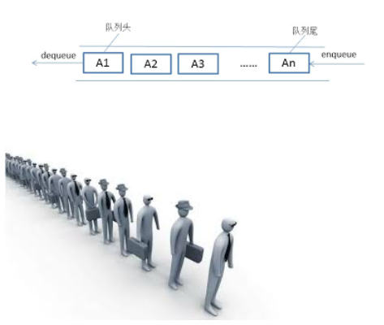

# 队列
队列（queue）是只允许在一端进行插入操作，而在另一端进行删除操作的线性表。

队列是一种先进先出的（First In First Out）的线性表，简称FIFO。允许插入的一端为队尾，允许删除的一端为队头。队列不允许在中间部位进行操作！假设队列是q=（a1，a2，……，an），那么a1就是队头元素，而an是队尾元素。这样我们就可以删除时，总是从a1开始，而插入时，总是在队列最后。这也比较符合我们通常生活中的习惯，排在第一个的优先出列，最后来的当然排在队伍最后。



# 队列的实现
同栈一样，队列也可以用顺序表或者链表实现。

## 操作
*  Queue() 创建一个空的队列
*  enqueue(item) 往队列中添加一个item元素
*  dequeue() 从队列头部删除一个元素
*  is_empty() 判断一个队列是否为空
*  size() 返回队列的大小

```py
class Queue(object):
    """队列"""
    def __init__(self):
        self.items = []

    def is_empty(self):
        return self.items == []

    def enqueue(self, item):
        """进队列"""
        self.items.insert(0,item)

    def dequeue(self):
        """出队列"""
        return self.items.pop()

    def size(self):
        """返回大小"""
        return len(self.items)

if __name__ == "__main__":
    q = Queue()
    q.enqueue("hello")
    q.enqueue("world")
    q.enqueue("itcast")
    print q.size()
    print q.dequeue()
    print q.dequeue()
    print q.dequeue()
```
    
# 双端队列
双端队列（deque，全名double-ended queue），是一种具有队列和栈的性质的数据结构。

双端队列中的元素可以从两端弹出，其限定插入和删除操作在表的两端进行。双端队列可以在队列任意一端入队和出队。


## 操作
*  Deque() 创建一个空的双端队列
*  add_front(item) 从队头加入一个item元素
*  add_rear(item) 从队尾加入一个item元素
*  remove_front() 从队头删除一个item元素
*  remove_rear() 从队尾删除一个item元素
*  is_empty() 判断双端队列是否为空
*  size() 返回队列的大小
## 实现
```
class Deque(object):
    """双端队列"""
    def __init__(self):
        self.items = []

    def is_empty(self):
        """判断队列是否为空"""
        return self.items == []

    def add_front(self, item):
        """在队头添加元素"""
        self.items.insert(0,item)

    def add_rear(self, item):
        """在队尾添加元素"""
        self.items.append(item)

    def remove_front(self):
        """从队头删除元素"""
        return self.items.pop(0)

    def remove_rear(self):
        """从队尾删除元素"""
        return self.items.pop()

    def size(self):
        """返回队列大小"""
        return len(self.items)


if __name__ == "__main__":
    deque = Deque()
    deque.add_front(1)
    deque.add_front(2)
    deque.add_rear(3)
    deque.add_rear(4)
    print deque.size()
    print deque.remove_front()
    print deque.remove_front()
    print deque.remove_rear()
    print deque.remove_rear()
  ```
  
