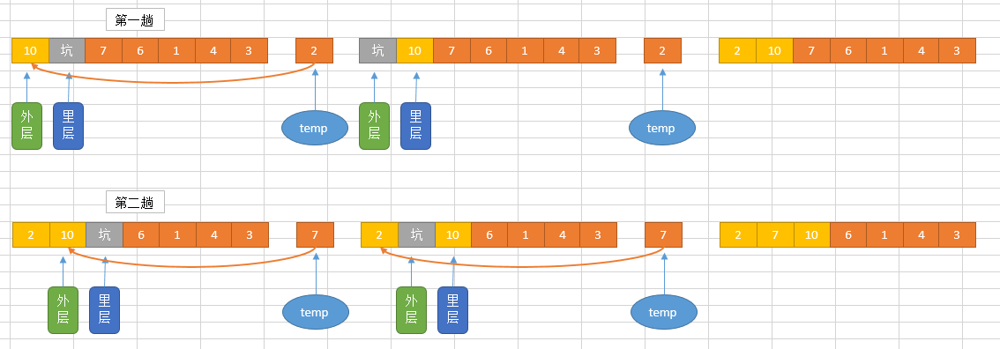
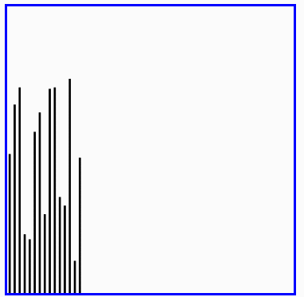

# 排序与搜索
排序算法（英语：Sorting algorithm）是一种能将一串数据依照特定顺序进行排列的一种算法。

## 排序算法的稳定性
`稳定性`：稳定排序算法会让原本有相等键值的纪录维持相对次序。也就是如果一个排序算法是稳定的，当有两个相等键值的纪录R和S，且在原本的列表中R出现在S之前，在排序过的列表中R也将会是在S之前。

当相等的元素是无法分辨的，比如像是整数，稳定性并不是一个问题。然而，假设以下的数对将要以他们的第一个数字来排序。
```
(4, 1)  (3, 1)  (3, 7)（5, 6）
```
在这个状况下，有可能产生两种不同的结果，一个是让相等键值的纪录维持相对的次序，而另外一个则没有：
```
(3, 1)  (3, 7)  (4, 1)  (5, 6)  （维持次序）
(3, 7)  (3, 1)  (4, 1)  (5, 6)  （次序被改变）
```
不稳定排序算法可能会在相等的键值中改变纪录的相对次序，但是稳定排序算法从来不会如此。不稳定排序算法可以被特别地实现为稳定。作这件事情的一个方式是人工扩充键值的比较，如此在其他方面相同键值的两个对象间之比较，（比如上面的比较中加入第二个标准：第二个键值的大小）就会被决定使用在原先数据次序中的条目，当作一个同分决赛。然而，要记住这种次序通常牵涉到额外的空间负担。

# 6.1 冒泡排序
`冒泡排序`（英语：Bubble Sort）是一种简单的排序算法。它重复地遍历要排序的数列，一次比较两个元素，如果他们的顺序错误就把他们交换过来。遍历数列的工作是重复地进行直到没有再需要交换，也就是说该数列已经排序完成。这个算法的名字由来是因为越小的元素会经由交换慢慢“浮”到数列的顶端。

冒泡排序算法的运作如下：

*  比较相邻的元素。如果第一个比第二个大（升序），就交换他们两个。
*  对每一对相邻元素作同样的工作，从开始第一对到结尾的最后一对。这步做完后，最后的元素会是最大的数。
*  针对所有的元素重复以上的步骤，除了最后一个。
*  持续每次对越来越少的元素重复上面的步骤，直到没有任何一对数字需要比较。

# 冒泡排序的分析

## 代码
```py
# coding = utf-8
def bubble_sort(alist):
	n = len(alist)
	for j in range(n).__reversed__():
		for i in range(j):
			if alist[i] > alist[i + 1]:
				alist[i], alist[i + 1] = alist[i + 1], alist[i]


if __name__ == '__main__':
	alist = [54, 26, 93, 17, 77, 31, 44, 55, 20]
	# alist = [1, 2, 3, 4, 5]
	bubble_sort(alist)
	print(alist)
```

## 时间复杂度
* 最优时间复杂度：O(n) （表示遍历一次发现没有任何可以交换的元素，排序结束。）
* 最坏时间复杂度：O(<a href="https://www.codecogs.com/eqnedit.php?latex=n^{2}" target="_blank"></a>)
* 稳定性：稳定

# 6.2 选择排序
选择排序（Selection sort）是一种简单直观的排序算法。它的工作原理如下。首先在未排序序列中找到最小（大）元素，存放到排序序列的起始位置，然后，再从剩余未排序元素中继续寻找最小（大）元素，然后放到已排序序列的末尾。以此类推，直到所有元素均排序完毕。

选择排序的主要优点与数据移动有关。如果某个元素位于正确的最终位置上，则它不会被移动。选择排序每次交换一对元素，它们当中至少有一个将被移到其最终位置上，因此对n个元素的表进行排序总共进行至多n-1次交换。在所有的完全依靠交换去移动元素的排序方法中，选择排序属于非常好的一种。

## 选择排序分析
排序过程：


红色表示当前最小值，黄色表示已排序序列，蓝色表示当前位置。

```py
# coding = utf-8
def select_sort(alist):
	n = len(alist)
	for j in range(n):
		min_index = j
		for i in range(j + 1, n):  # 从j+1个数开始判断
			if alist[i] < alist[min_index]:
				alist[i], alist[min_index] = alist[min_index], alist[i]


if __name__ == '__main__':
	alist = [54, 26, 93, 17, 77, 31, 44, 55, 20]
	# alist = [1, 2, 3, 4, 5]
	select_sort(alist)
	print(alist)
```
## 时间复杂度
* 最优时间复杂度：O(<a href="https://www.codecogs.com/eqnedit.php?latex=n^{2}" target="_blank"></a>)
* 最坏时间复杂度：O(<a href="https://www.codecogs.com/eqnedit.php?latex=n^{2}" target="_blank"></a>)
* 稳定性：不稳定（考虑升序每次选择最大的情况）
## 选择排序演示


# 6.3 插入排序
插入排序（英语：Insertion Sort）是一种简单直观的排序算法。它的工作原理是通过构建有序序列，对于未排序数据，在已排序序列中从后向前扫描，找到相应位置并插入。插入排序在实现上，在从后向前扫描过程中，需要反复把已排序元素逐步向后挪位，为最新元素提供插入空间。

## 插入排序分析



####version 1
```py
# coding = utf-8
def insert_sort(alist):
	n = len(alist)
	for j in range(n+1):
		for i in range(j).__reversed__():
			if alist[i] < alist[i-1] and i-1>= 0:
				alist[i], alist[i-1] = alist[i-1], alist[i]


if __name__ == '__main__':
	alist = [54, 26, 93, 17, 77, 31, 44, 55, 20]
	# alist = [1, 2, 3, 4, 5]
	insert_sort(alist)
	print(alist)
```
#### version 2
```py 
def insert_sort(alist):
	n = len(alist)

	for j in range(1, n):
		i = j
		while i > 0:
			if alist[i] < alist[i - 1]:
				alist[i - 1], alist[i], = alist[i], alist[i - 1]
				i -= 1
			else: break #如果比前面都大就退出

if __name__ == '__main__':
	li = [54, 26, 93, 17, 77, 31, 44, 55, 20]
	print(li)
	insert_sort(li)
	print(li)
```
## 时间复杂度
* 最优时间复杂度：O(n) （升序排列，序列已经处于升序状态）
* 最坏时间复杂度：O(<a href="https://www.codecogs.com/eqnedit.php?latex=n^{2}" target="_blank"></a>)
* 稳定性：稳定
## 插入排序演示


# 6.4 希尔排序
希尔排序(Shell Sort)是插入排序的一种。也称缩小增量排序，是直接插入排序算法的一种更高效的改进版本。希尔排序是非稳定排序算法。该方法因DL．Shell于1959年提出而得名。 希尔排序是把记录按下标的一定增量分组，对每组使用直接插入排序算法排序；随着增量逐渐减少，每组包含的关键词越来越多，当增量减至1时，整个文件恰被分成一组，算法便终止。

## 希尔排序过程
希尔排序的基本思想是：将数组列在一个表中并对列分别进行插入排序，重复这过程，不过每次用更长的列（步长更长了，列数更少了）来进行。最后整个表就只有一列了。将数组转换至表是为了更好地理解这算法，算法本身还是使用数组进行排序。

例如，假设有这样一组数[ 13 14 94 33 82 25 59 94 65 23 45 27 73 25 39 10 ]，如果我们以步长为5开始进行排序，我们可以通过将这列表放在有5列的表中来更好地描述算法，这样他们就应该看起来是这样(竖着的元素是步长组成)：
```
13 14 94 33 82
25 59 94 65 23
45 27 73 25 39
10
```
然后我们对每列进行排序：
```
10 14 73 25 23
13 27 94 33 39
25 59 94 65 82
45
```
将上述四行数字，依序接在一起时我们得到：[ 10 14 73 25 23 13 27 94 33 39 25 59 94 65 82 45 ]。这时10已经移至正确位置了，然后再以3为步长进行排序：
```
10 14 73
25 23 13
27 94 33
39 25 59
94 65 82
45
```
排序之后变为：
```
10 14 13
25 23 33
27 25 59
39 65 73
45 94 82
94
```
最后以1步长进行排序（此时就是简单的插入排序了）

## 希尔排序的分析

#### version 1
```py
# coding = utf-8
def shell_sort(alist):
	n = len(alist)
	gap = n // 2
	while gap > 0:
		for i in range(gap, n):
			while i - gap >= 0 and  alist[i - gap] > alist[i] :
				alist[i - gap], alist[i] = alist[i], alist[i - gap]
				i -= gap
		gap = gap // 2


if __name__ == '__main__':
	alist = [54, 26, 93, 17, 77, 31, 44, 55, 20]
	# alist = [1, 2, 3, 4, 5]
	shell_sort(alist)
	print(alist)
```

#### version 2
```py
def shell_sort(alist):
	n = len(alist)
	gap = n // 2
	while gap > 0:
		for j in range(gap, n):
			i = j
			while i > 0:
				if alist[i] < alist[i - gap] and i - gap >= 0:
					alist[i - gap], alist[i], = alist[i], alist[i - gap]
					i -= gap
				else:
					break  # 如果比前面都大就退出
		gap //= 2


if __name__ == '__main__':
	li = [54, 26, 93, 17, 77, 31, 1]
	print(li)
	shell_sort(li)
	print(li)
```
## 时间复杂度

* 最优时间复杂度：根据步长序列的不同而不同
* 最坏时间复杂度：O(<a href="https://www.codecogs.com/eqnedit.php?latex=n^{2}" target="_blank"></a>)
* 稳定想：不稳定

## 希尔排序演示


# 6.5 快速排序 `很重要`
快速排序（英语：Quicksort），又称划分交换排序（partition-exchange sort），通过一趟排序将要排序的数据分割成独立的两部分，其中一部分的所有数据都比另外一部分的所有数据都要小，然后再按此方法对这两部分数据分别进行快速排序，整个排序过程可以递归进行，以此达到整个数据变成有序序列。

步骤为：

从数列中挑出一个元素，称为"基准"（pivot），
重新排序数列，所有元素比基准值小的摆放在基准前面，所有元素比基准值大的摆在基准的后面（相同的数可以到任一边）。在这个分区结束之后，该基准就处于数列的中间位置。这个称为分区（partition）操作。
递归地（recursive）把小于基准值元素的子数列和大于基准值元素的子数列排序。
递归的最底部情形，是数列的大小是零或一，也就是永远都已经被排序好了。虽然一直递归下去，但是这个算法总会结束，因为在每次的迭代（iteration）中，它至少会把一个元素摆到它最后的位置去。

## 快速排序的分析


```py

# coding = utf-8
def quick_sort(alist, first, last):
	if first >= last:
		return
	low = first
	high = last
	mid_value = alist[low]

	while low < high:
		while low < high and alist[high] >= mid_value:
			high -= 1
		alist[low] = alist[high]

		while low < high and alist[low] < mid_value:
			low += 1
		alist[high] = alist[low]
	alist[low] = mid_value

	quick_sort(alist, first, low - 1)
	quick_sort(alist, low + 1, last)


if __name__ == '__main__':
	li = [5, 9, 10, 2, 4, 6]
	print(li)
	quick_sort(li, 0, len(li) - 1)
	print(li)

```

## 时间复杂度
* 最优时间复杂度：O(nlogn)
* 最坏时间复杂度：O(<a href="https://www.codecogs.com/eqnedit.php?latex=n^{2}" target="_blank"></a>)
* 稳定性：不稳定
从一开始快速排序平均需要花费O(n log n)时间的描述并不明显。但是不难观察到的是分区运算，数组的元素都会在每次循环中走访过一次，使用O(n)的时间。在使用结合（concatenation）的版本中，这项运算也是O(n)。

在最好的情况，每次我们运行一次分区，我们会把一个数列分为两个几近相等的片段。这个意思就是每次递归调用处理一半大小的数列。因此，在到达大小为一的数列前，我们只要作log n次嵌套的调用。这个意思就是调用树的深度是O(log n)。但是在同一层次结构的两个程序调用中，不会处理到原来数列的相同部分；因此，程序调用的每一层次结构总共全部仅需要O(n)的时间（每个调用有某些共同的额外耗费，但是因为在每一层次结构仅仅只有O(n)个调用，这些被归纳在O(n)系数中）。结果是这个算法仅需使用O(n log n)时间。

## 快速排序演示


# 6.6 归并排序
归并排序是采用分治法的一个非常典型的应用。归并排序的思想就是先递归分解数组，再合并数组。

将数组分解最小之后，然后合并两个有序数组，基本思路是比较两个数组的最前面的数，谁小就先取谁，取了后相应的指针就往后移一位。然后再比较，直至一个数组为空，最后把另一个数组的剩余部分复制过来即可。

## 归并排序的分析


```py
# coding = utf-8
def merge_sort(alist):
	n = len(alist)
	if n <= 1:
		return alist
	mid_index = n // 2

	left = merge_sort(alist[:mid_index])
	right = merge_sort(alist[mid_index:])

	return merge(left, right)


def merge(left, right):
	l, r = 0, 0
	result = []
	while l < len(left) and r < len(right):
		if left[l] < right[r]:
			result.append(left[l])
			l += 1
		else:
			result.append(right[r])
			r += 1
	result += left[l:]
	result += right[r:]
	return result


if __name__ == '__main__':
	li = [5, 9, 10, 2, 4, 6]
	print(li)
	print(merge_sort(li))
```

## 时间复杂度
* 最优时间复杂度：O(nlogn)
* 最坏时间复杂度：O(nlogn)
* 稳定性：稳定

# 常见排序算法效率比较


# 二分法查找
二分查找又称折半查找，优点是比较次数少，查找速度快，平均性能好；其缺点是要求待查表为有序表，且插入删除困难。因此，折半查找方法适用于不经常变动而查找频繁的有序列表。首先，假设表中元素是按升序排列，将表中间位置记录的关键字与查找关键字比较，如果两者相等，则查找成功；否则利用中间位置记录将表分成前、后两个子表，如果中间位置记录的关键字大于查找关键字，则进一步查找前一子表，否则进一步查找后一子表。重复以上过程，直到找到满足条件的记录，使查找成功，或直到子表不存在为止，此时查找不成功。


## 二分法查找实现
### （非递归实现）
```py
# coding = utf-8
def binary_search(alist, item):
	first = 0
	last = len(alist) - 1
	while first < last:
		mid_index = (first + last) // 2
		if alist[mid_index] == item:
			return True
		elif item < alist[mid_index]:
			last = mid_index - 1
		else:
			first = mid_index + 1
	return False


if __name__ == '__main__':
	testlist = [1,2,3,4,5,6,7,8,91,100]
	print(binary_search(testlist, 3))
	print(binary_search(testlist, 13))
```
### （递归实现）
```py
# coding = utf-8
def binary_search(alist, item):
	if len(alist) == 0:
		return False
	else:
		mid_index = len(alist) // 2
		if alist[mid_index] == item:
			return True
		else:
			if item < alist[mid_index]:
				return binary_search(alist[:mid_index], item)
			else:
				return binary_search(alist[mid_index + 1:], item)


if __name__ == '__main__':
	testlist = [0, 1, 2, 8, 13, 17, 19, 32, 42, ]
	print(binary_search(testlist, 3))
	# print(binary_search(testlist, 13))
```
## 时间复杂度
* 最优时间复杂度：O(1)
* 最坏时间复杂度：O(logn)
