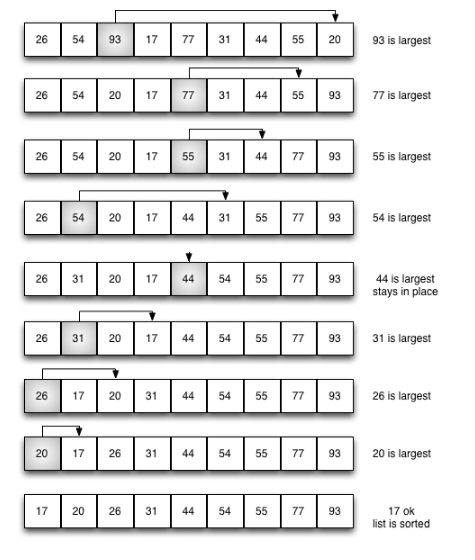

# 排序与搜索
排序算法（英语：Sorting algorithm）是一种能将一串数据依照特定顺序进行排列的一种算法。

## 排序算法的稳定性
`稳定性`：稳定排序算法会让原本有相等键值的纪录维持相对次序。也就是如果一个排序算法是稳定的，当有两个相等键值的纪录R和S，且在原本的列表中R出现在S之前，在排序过的列表中R也将会是在S之前。

当相等的元素是无法分辨的，比如像是整数，稳定性并不是一个问题。然而，假设以下的数对将要以他们的第一个数字来排序。
```
(4, 1)  (3, 1)  (3, 7)（5, 6）
```
在这个状况下，有可能产生两种不同的结果，一个是让相等键值的纪录维持相对的次序，而另外一个则没有：
```
(3, 1)  (3, 7)  (4, 1)  (5, 6)  （维持次序）
(3, 7)  (3, 1)  (4, 1)  (5, 6)  （次序被改变）
```
不稳定排序算法可能会在相等的键值中改变纪录的相对次序，但是稳定排序算法从来不会如此。不稳定排序算法可以被特别地实现为稳定。作这件事情的一个方式是人工扩充键值的比较，如此在其他方面相同键值的两个对象间之比较，（比如上面的比较中加入第二个标准：第二个键值的大小）就会被决定使用在原先数据次序中的条目，当作一个同分决赛。然而，要记住这种次序通常牵涉到额外的空间负担。

# 6.1 冒泡排序
`冒泡排序`（英语：Bubble Sort）是一种简单的排序算法。它重复地遍历要排序的数列，一次比较两个元素，如果他们的顺序错误就把他们交换过来。遍历数列的工作是重复地进行直到没有再需要交换，也就是说该数列已经排序完成。这个算法的名字由来是因为越小的元素会经由交换慢慢“浮”到数列的顶端。

冒泡排序算法的运作如下：

*  比较相邻的元素。如果第一个比第二个大（升序），就交换他们两个。
*  对每一对相邻元素作同样的工作，从开始第一对到结尾的最后一对。这步做完后，最后的元素会是最大的数。
*  针对所有的元素重复以上的步骤，除了最后一个。
*  持续每次对越来越少的元素重复上面的步骤，直到没有任何一对数字需要比较。

# 冒泡排序的分析

## 代码
```py
# coding = utf-8
def bubble_sort(alist):
	n = len(alist)
	for j in range(n).__reversed__():
		for i in range(j):
			if alist[i] > alist[i + 1]:
				alist[i], alist[i + 1] = alist[i + 1], alist[i]


if __name__ == '__main__':
	alist = [54, 26, 93, 17, 77, 31, 44, 55, 20]
	# alist = [1, 2, 3, 4, 5]
	bubble_sort(alist)
	print(alist)
```

## 时间复杂度
* 最优时间复杂度：O(n) （表示遍历一次发现没有任何可以交换的元素，排序结束。）
* 最坏时间复杂度：O(<a href="https://www.codecogs.com/eqnedit.php?latex=n^{2}" target="_blank"></a>)
* 稳定性：稳定

# 6.2 选择排序
选择排序（Selection sort）是一种简单直观的排序算法。它的工作原理如下。首先在未排序序列中找到最小（大）元素，存放到排序序列的起始位置，然后，再从剩余未排序元素中继续寻找最小（大）元素，然后放到已排序序列的末尾。以此类推，直到所有元素均排序完毕。

选择排序的主要优点与数据移动有关。如果某个元素位于正确的最终位置上，则它不会被移动。选择排序每次交换一对元素，它们当中至少有一个将被移到其最终位置上，因此对n个元素的表进行排序总共进行至多n-1次交换。在所有的完全依靠交换去移动元素的排序方法中，选择排序属于非常好的一种。

## 选择排序分析
排序过程：




红色表示当前最小值，黄色表示已排序序列，蓝色表示当前位置。

```py
# coding = utf-8
def select_sort(alist):
	n = len(alist)
	for j in range(n):
		min_index = j
		for i in range(j + 1, n):  # 从j+1个数开始判断
			if alist[i] < alist[min_index]:
				alist[i], alist[min_index] = alist[min_index], alist[i]


if __name__ == '__main__':
	alist = [54, 26, 93, 17, 77, 31, 44, 55, 20]
	# alist = [1, 2, 3, 4, 5]
	select_sort(alist)
	print(alist)
```
## 时间复杂度
* 最优时间复杂度：O(<a href="https://www.codecogs.com/eqnedit.php?latex=n^{2}" target="_blank"></a>)
* 最坏时间复杂度：O(<a href="https://www.codecogs.com/eqnedit.php?latex=n^{2}" target="_blank"></a>)
* 稳定性：不稳定（考虑升序每次选择最大的情况）
## 选择排序演示
